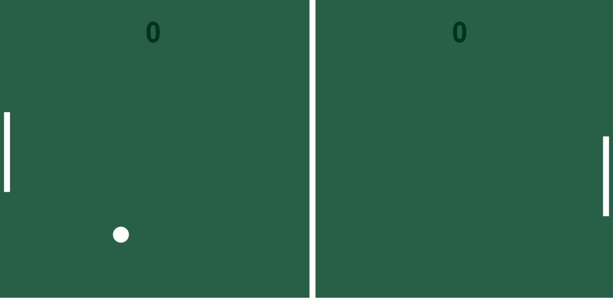

# Ping Pong Game

This is a project of a Ping Pong Game, created with Javascript (Vanilla). 

---
## Table of contents

- [Overview](#🌞-overview)
  - [Screenshot](#📸-screenshot)
  - [Links](#🔗-links)
- [My process](#🤔-my-process)
  - [Built with](#🏗️-built-with)
  - [What I learned](#🧠-what-i-learned)
  - [Useful resources](#👩‍💻-useful-resources)
- [Author](#😸-author)

---

## 🌞 Overview

### :camera_flash: Screenshot



### 🔗 Links

- Solution URL: [GitHub Repository](#)
- Live Site URL: [GitHub Page](#)

---

## 🤔 My process

### 🏗️ Built with

- Javascript (Vanilla)


### 🧠 What I learned

Basically learned simple functions of Javascript. 

This it what I'm proud of learning in this challenge:

```javascript
            _calcPosition: function () {
                if(this.x > field.w - this.r - paddleRight.w - gapX){
                    if (this.y + this.r > paddleRight.y && this.y - this.r < paddleRight.y + paddleRight.h) {
                        this._reverseX()
                    } 
                    
                    else {
                        score.increaseHuman()
                        this._pointUp()
                    }
        
                }

                if (this.x < 0 + this.r + paddleLeft.w + gapX) {
                    if (this.y + this.r > paddleLeft.y && this.y -this.r < paddleLeft.y + paddleLeft.h) {
                        this._reverseX()

                    } 
                    
                    else {
                    score.increaseComputer()
                    this._pointUp()
                }
                }
```


## 😸 Author

### Amanda Padilha
- Portfolio - [Amanda Padilha](https://amandapadi.notion.site/Amanda-Padilha-Portf-lio-f5cc302c77014bea8a538ab908342784)
- Github - [Padilha04](https://github.com/Padilha04)
- LinkedIn - [Amanda Padilha](www.linkedin.com/in/amanda-padilha)
